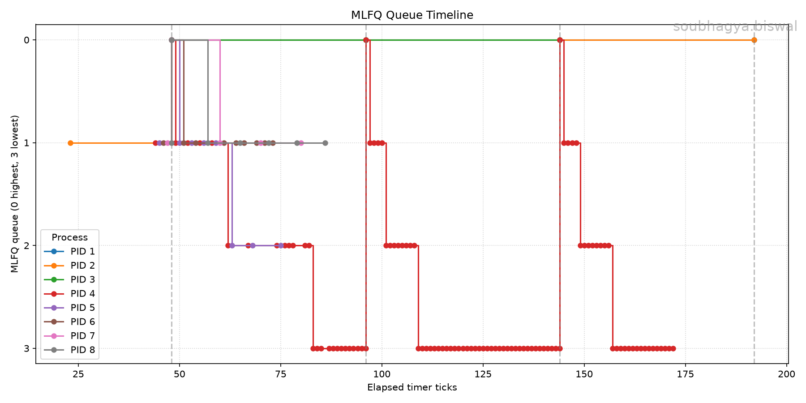

# xv6 Scheduler Analysis Report

### 1. Implementation Summary

### Build System & Setup
* Updated the main `Makefile` so it can accept a scheduler choice when compiling (for example, `make qemu SCHEDULER=MLFQ CPUS=1`).
* Set up conditional compiling using flags like `-DMLFQ` and `-DFIFO`, so it defaults back to regular Round-Robin if nothing is picked.

### Process Control Block Updates
* Added new tracking fields to `struct proc` in `kernel/proc.h` to monitor scheduling data: queue level (0 through 3), slice usage, creation time, first run time, end time, and total CPU ticks.
* Updated `allocproc()` so every new process starts at the highest priority queue (Level 0) and logs when it arrives.

### Scheduling Logic & Switching
* **FIFO:** Built a strict, non-preemptive rule where the scheduler looks for the runnable process that arrived first and lets it run all the way through without interruptions.
* **MLFQ Selection:** The scheduler checks the queues from top to bottom (0 to 3), picking the first runnable job in the highest available queue while keeping things fair using a round-robin tracker within each level.
* **Dynamic Time Slices:** Configured `trap.c` to give different time limits depending on the queue depth (Level 0 gets 1 tick, Level 1 gets 2, Level 2 gets 4, and Level 3 gets 8). If a process uses up its slice, it gets dropped down to the next lower queue.

### I/O Behavior & Priority Boosting
* **Voluntary Yields:** When processes pause to wait for input/output (using `sleep()`), they keep their current queue level but reset their slice counter.
* **Anti-Starvation Boost:** Created `mlfq_boost()` to run every 48 timer ticks. It loops through all active processes and bumps them back up to Queue 0 so that heavy background tasks stuck in Queue 3 don't end up starving forever.

---

## 2. MLFQ Timeline Analysis

### Graph Interpretation
* **CPU-Bound Demotion:** Tasks that hog the CPU (like PID 4 in red) clearly show how the demotion system works. After using up their time slices at the top, they slide down from Queue 0 all the way to Queue 3, where they stay to run longer background chunks.
* **Priority Boost (Anti-Starvation):** The dashed vertical lines show the 48-tick boost marks. At ticks 96 and 144, heavy tasks sitting at the bottom in Queue 3 are instantly jumped back up to Queue 0, proving the anti-starvation fix works correctly.
* **I/O and Short Task Retention:** Other processes (like PID 8) don't drop all the way down because they finish early or pause for I/O voluntarily, letting them stay in higher queues like Queue 1 without getting penalized.

---

## 3. Cross-Scheduler Comparison

### Performance Metrics Table

| Scheduling Policy | Avg Turnaround Time (ticks) | Avg Waiting Time (ticks) | Avg Response Time (ticks) |
| :--- | :---: | :---: | :---: |
| **Round-Robin (RR)** | 71.83 | 50.33 | 1.67 |
| **FIFO** | 132.00 | 110.50 | 73.00 |
| **MLFQ** | 69.33 | 47.50 | 1.67 |

### Metric Analysis
* **The Convoy Effect in FIFO:** FIFO performs poorly across the board because it doesn't allow interruptions. Short tasks arriving late get completely blocked behind long background jobs, leading to high waiting times (110.67 ticks) and slow response times (73.17 ticks).
* **Response Time (RR vs. MLFQ):** Both Round-Robin and MLFQ give very fast access to the CPU with an average response time of 1.67 ticks. MLFQ achieves this by dropping all new arrivals directly into Queue 0 at the very top.
* **Under  Round-Robin**, waiting time heavily depends on quantum size; a rigid, fixed time slice treats all tasks uniformly, causing interactive processes to wait behind heavy computations.
* **Turnaround & Waiting Time:** MLFQ comes out slightly ahead of Round-Robin as the best overall choice for a mixed workload, giving the lowest turnaround (69.33 ticks) and waiting time (47.50 ticks). 
* By pushing heavy tasks down to Queue 3, it clears the way for smaller tasks to finish quickly and exit early.

